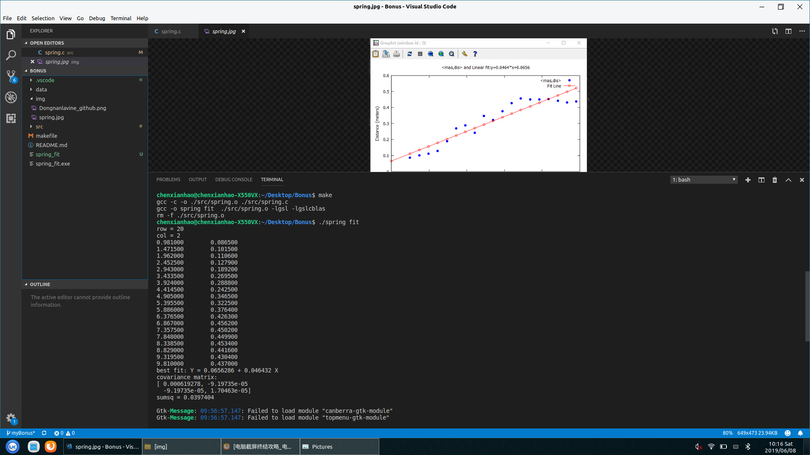

**我所做的工作如下：**

* 1.在VS里面编程，用C语言读取了spring_data.csv文件，然后用gsl_fit_linear对数据进行了线性回归的处理。
      
      
* 2.下载安装了gnuplot，并将其添加到系统环境变量的path里。
* 3.在spring.c编写利用gnuplot的绘图代码，绘制数据的分布点图和线性拟合直线图。
* 4.之前已经安装过git，利用老师给的参考步骤，在Bonus文件夹下，打开终端，进行了本地Git和远程Github版本控制的初始化。在之前注册的github账号下建立新的repository--Bonus。
* 5.对git进行版本控制，然后把Bonus同步更新到我的github上。
     
     [my github address](https://github.com/Dongnanlavine)
     

